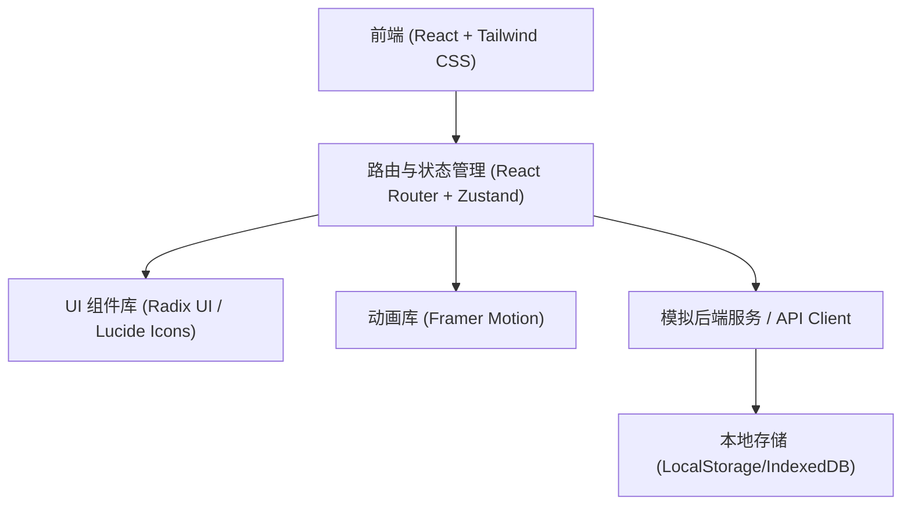
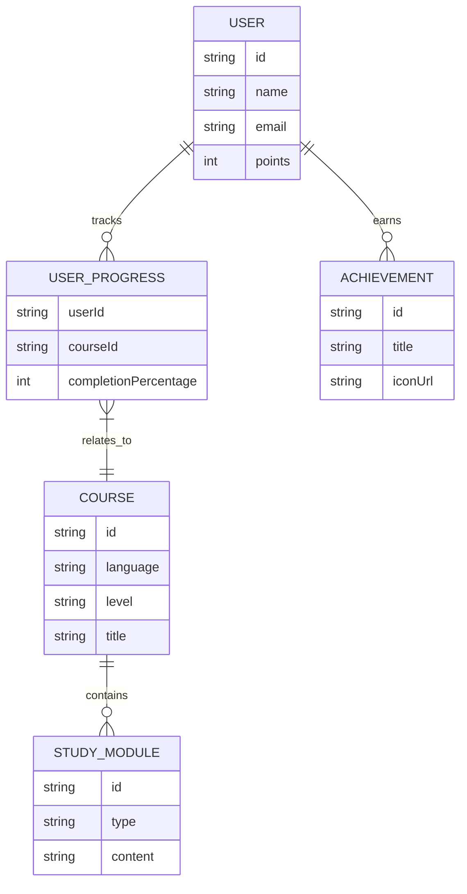

## 1. 架构设计


## 2. 技术栈说明
- **前端框架**: React 18 + Vite
- **样式方案**: Tailwind CSS 3
- **路由管理**: React Router v6
- **状态管理**: Zustand (用于轻量级全局状态管理，如用户登录状态、学习进度)
- **动画与交互**: Framer Motion (用于页面切换、卡片翻转、微交互动画)
- **图标与组件**: Lucide React, Radix UI (无头组件用于提升无障碍访问)
- **数据存储**: Mock 数据 + LocalStorage (模拟后端持久化)

## 3. 路由定义
| 路由路径 | 页面说明 |
|-------|---------|
| `/` | 落地页 (平台介绍、特性展示) |
| `/login` | 登录/注册页 |
| `/dashboard` | 用户首页 (学习概览、进度追踪、推荐路径) |
| `/courses` | 课程大厅 (语种切换、分级课程列表) |
| `/study/:courseId` | 沉浸式学习模块 (包含单词、听力、口语、语法) |
| `/community` | 社区交流与排行榜 |
| `/profile` | 个人中心 (成就激励、详细数据) |

## 4. API 定义 (Mock 数据结构)
本项目主要为前端实现，采用本地模拟数据。
```typescript
// 用户类型
interface User {
  id: string;
  name: string;
  avatar: string;
  level: string; // e.g., 'A1', 'B2'
  points: number;
}

// 课程类型
interface Course {
  id: string;
  language: 'English' | 'Japanese' | 'Korean';
  level: string;
  title: string;
  description: string;
  progress: number; // 0-100
  modules: StudyModule[];
}

// 学习模块类型
interface StudyModule {
  id: string;
  type: 'vocabulary' | 'grammar' | 'speaking' | 'listening';
  content: any; // 具体题目或内容
  isCompleted: boolean;
}
```

## 5. 数据模型设计
