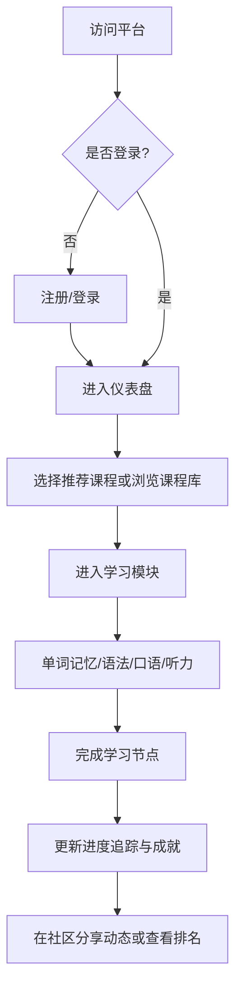

## 1. 产品概述
本项目是一款支持多语种（英语、日语、韩语等）学习的沉浸式在线教育平台。
旨在通过分级课程、互动式练习、个性化推荐和社区激励，为用户提供高效、有趣且具有深度的语言学习体验。

## 2. 核心功能

### 2.1 用户角色
| 角色 | 注册方式 | 核心权限 |
|------|---------------------|------------------|
| 访客 | 无 | 浏览平台介绍、部分试听课程 |
| 注册用户 | 邮箱/第三方账号注册 | 完整学习所有模块、参与社区互动、记录学习进度 |

### 2.2 功能模块
1. **认证模块**：用户注册、登录、密码找回。
2. **首页（仪表盘）**：个性化学习路径推荐、学习进度追踪概览、近期成就展示。
3. **分级课程体系**：多语种选择、难度分级（入门、初级、中级、高级）、课程列表及详情。
4. **互动式学习模块**：单词记忆（卡片式）、语法练习（选择/填空）、口语跟读（录音对比）、听力训练（音视频材料）。
5. **社区与激励系统**：学习动态分享、排行榜、成就徽章收集。

### 2.3 页面详情
| 页面名称 | 模块名称 | 功能描述 |
|-----------|-------------|---------------------|
| 首页/仪表盘 | 概览模块 | 展示今日学习目标、整体进度环形图、推荐的下一步学习内容 |
| 课程大厅 | 语种与分级导航 | 切换不同语言，按级别筛选课程卡片 |
| 学习详情页 | 互动练习区 | 包含单词翻转卡、听力播放器、口语录音按钮、语法测试表单 |
| 社区动态 | 交流与排行榜 | 用户发帖列表、点赞/评论、周/月学习时长排行榜 |
| 个人中心 | 成就与进度 | 详细数据统计图表、已解锁的成就徽章展示、账号设置 |

## 3. 核心流程
用户核心学习流程包括：登录 -> 查看推荐路径 -> 进入课程 -> 完成互动练习 -> 获得成就并更新进度。

## 4. 用户界面设计
### 4.1 设计风格
- **主色调**：深邃的午夜蓝（#0f172a）为主背景（沉浸感），搭配充满活力的品牌色如电光紫（#8b5cf6）和青绿色（#14b8a6）作为点缀和高亮。
- **按钮风格**：现代微质感，带有微妙的渐变和悬浮发光效果（Glow effect）。
- **字体与排版**：无衬线字体（如 Inter 或 Roboto 结合系统字体），大号粗体标题搭配高对比度正文，留白充足。
- **布局风格**：卡片式布局，侧边导航或顶部宽版导航，关键模块使用玻璃拟物化（Glassmorphism）增强层次感。
- **图标/表情风格**：使用 3D 风格或高质感的 2D 插画/图标，以提升趣味性和游戏化体验。

### 4.2 页面设计概览
| 页面名称 | 模块名称 | UI 元素 |
|-----------|-------------|-------------|
| 仪表盘 | 进度与推荐 | 带有动画填充的环形进度条、平滑过渡的课程推荐卡片 |
| 学习模块 | 互动练习 | 可3D翻转的单词卡片、带有波形动画的录音组件、沉浸式全屏学习模式 |
| 社区页面 | 动态列表 | 瀑布流或列表布局，点赞时带有微交互动画（如心形粒子弹出） |

### 4.3 响应式设计
采用桌面端优先（Desktop-first）策略，同时完美适配移动端。移动端采用底部导航栏，触摸目标放大，卡片改为单列堆叠，优化侧滑手势操作。